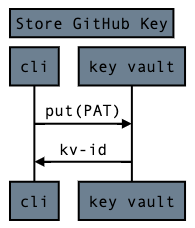

# Sequence Diagrams

[**Sequence diagrams**](https://bramp.github.io/js-sequence-diagrams/?utm_source=cdnjs&utm_medium=cdnjs_link&utm_campaign=cdnjs_library) show a hypothetical exchange of messages between a number of participants. Use Sequence Diagrams to communicate how the back end services communicate with each other to service user requests. 

For example, the sequence diagram for "a user successfully adds a key to a key vault" would be:



It consists of a 
 * **title** : "Store Github Key"
 * **participants** : Participants are represented as blocks `cli` and `key-vault` and
 * **arrows** : Arrows connect the blocks annotated with 
    * `put(PAT)` for "put access token" and in the reverse direction
    * `kv-id` for "key vault id".

# Representation

Sequence Diagrams are encoded as a single http document which wraps a sequence of `div` statements in boilerplate. For example, the above "Store GitHub Key" is created from [store-github-key.html](./store-github-key.html) which is inlined here:

```html
<!DOCTYPE html>
<html>
  <head>
      <!-- Your title here -->
    <title>Sequence Diagram Example</title>
    <meta http-equiv='Content-Type' content='text/html;charset=utf-8'/>
    <script src="https://cdnjs.cloudflare.com/ajax/libs/jquery/2.1.4/jquery.js"></script>
    <script src="https://cdnjs.cloudflare.com/ajax/libs/raphael/2.1.4/raphael-min.js"></script>
    <script src="https://cdnjs.cloudflare.com/ajax/libs/underscore.js/1.8.3/underscore-min.js"></script>
    <script src="https://bramp.github.io/js-sequence-diagrams/js/sequence-diagram-min.js"></script>
    </head>
<body>
    <!-- Your first sequence diagram here -->
    <div class="diagram">

        <!-- Your title here -->
        Title: Store GitHub Key

        <!-- Your participants here -->
        participant cli
        participant key vault

        <!-- Your messages here -->
        cli->key vault: put(token)
        key vault->cli: kv-id
    </div>

    <!-- Your next sequence diagram here -->
    <!-- ... -->

</body>
    <script>
        $(".diagram").sequenceDiagram({ theme: 'simple' });
        $("rect[stroke='#000000']").attr('fill', 'slategray');
    </script>
</html>
```

# Gotchas

## Naming
No dashes. Participant names cannot contain dashes. For example, `key-vault` will cause the diagram to fail to render, but `key vault` will work. Seems the designers expect you to use natural language conventions, not naming conventions typically found in source code.